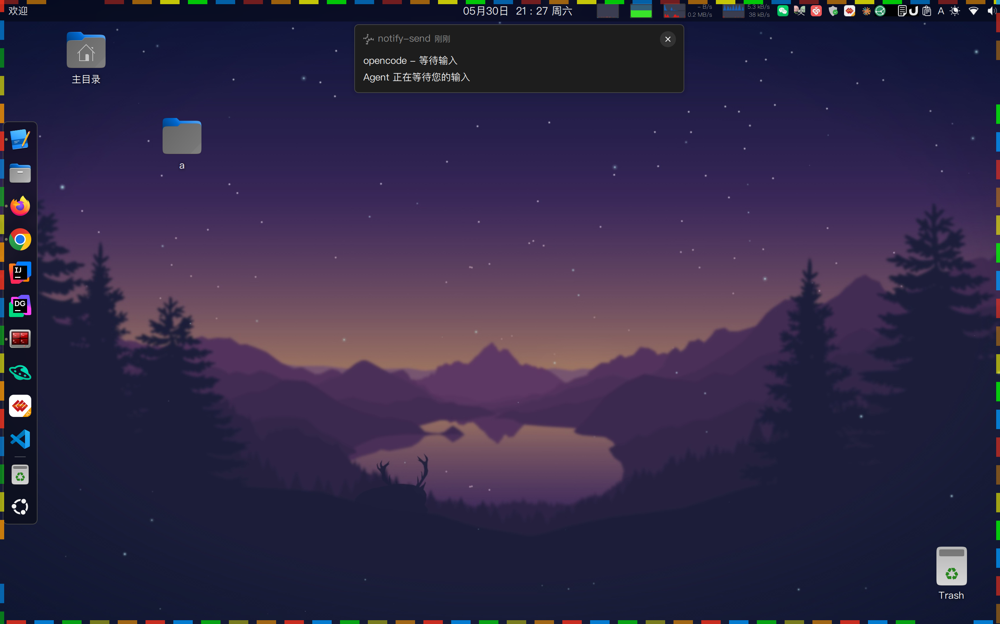

# opencode-notify

opencode 通知插件 — 监听会话中的关键事件，通过多渠道推送通知到你的手机、群聊或桌面。

> ⚠️ **由AI辅助生成，内容及程序请辨别使用**
>
> **个人项目，按需使用**
>
> 此插件主要面向作者个人使用场景开发和测试，不一定适合所有用户和环境。
>
> **AI 提示：**
> - Windows 系统通知需额外安装 [BurntToast](https://github.com/Windos/BurntToast) PowerShell 模块
> - Linux 系统通知需 `libnotify` 包（桌面发行版通常预装）
> - 事件映射基于 @opencode-ai/plugin@1.15.12 的行为，后续版本升级可能影响兼容性
> - `run_completed` 事件暂未实现（opencode 无直接完成事件）
> - 屏幕跑马灯效果仅 Linux X11 环境支持（依赖 Python + PyGObject），Wayland/macOS/Windows 不生效
> - 仅在 Ubuntu 24.04 (X11) 环境下测试并使用，其它平台未验证
>
> 如有问题欢迎提 Issue，但不保证及时响应和修复。

## 功能特性

- 监听 `permission_required` / `input_required` / `run_failed` 等事件
- 多渠道通知：系统通知、企业微信、飞书、自定义 Webhook（Gotify / Bark / PushDeer 等）
- YAML 配置文件，每项参数均有详细注释
- 去重机制：同一事件在时间窗口内不重复发送
- 会话感知抑制：活跃会话按事件类型智能过滤，不遗漏 `run_failed` 等重要通知
- 零外部运行时依赖（仅 js-yaml 用于配置解析）
- **屏幕跑马灯**：通知时屏幕四边高亮闪烁（Linux X11，Python + GTK 内置）
- **渠道级事件过滤**：每个渠道可独立配置监听哪些事件，灵活分流
- **远程延迟推送**：正常通知发出后，指定渠道额外延迟推送以防遗漏
- **Terminator 子屏检测**：自动检测子屏最大化场景，被遮挡的会话强制通知

## 平台支持

| 模块 | macOS | Linux | Windows |
|------|:-----:|:-----:|:-------:|
| 插件核心（事件监听/路由/分发） | ✅ | ✅ | ✅ |
| 自定义 Webhook / 企业微信 / 飞书 | ✅ | ✅ | ✅ |
| 诊断 CLI (`bun cli.ts`) | ✅ | ✅ | ✅ |
| **系统消息通知** | ✅ `osascript` 内置 | ⚠️ 需 `libnotify` 包 | ⚠️ 需 BurntToast 模块 |
| **屏幕跑马灯** | ❌ | ✅ Python+GTK 内置 | ❌ |

**说明：**
- **macOS**: 系统通知使用 `osascript`，系统内置，开箱即用
- **Linux**: 系统通知使用 `notify-send`，来自 `libnotify`。桌面发行版通常预装，如缺失可 `apt install libnotify-bin` / `yum install libnotify`
- **Windows**: 系统通知使用 PowerShell `New-BurntToastNotification`，需额外安装 [BurntToast](https://github.com/Windos/BurntToast) 模块。Webhook 渠道不受影响
- **屏幕跑马灯**: 仅 Linux X11 环境。使用 Python + PyGObject(GTK 3)，Ubuntu GNOME 桌面内置，无需额外安装。Wayland 暂不支持
- 非系统通知模块（Webhook 推送、CLI 诊断）均为纯 HTTP/Node API，全平台一致

> **已测试渠道：** 系统通知、企业微信、自定义 Webhook（Gotify）。飞书等其他渠道理论可用，暂未做验证。

## 快速开始

### 1. 安装

将插件添加到 `~/.config/opencode/opencode.json` 的 `plugin` 列表中：

**方式一：从 npm 安装（推荐）**
```bash
npm install -g @freely01/opencode-notify
```

```json
{
  "plugin": ["@freely01/opencode-notify"]
}
```

**方式二：本地路径（开发调试）**
```json
{
  "plugin": [
    "file:///home/<你的用户名>/path/to/opencode-notify/index.ts"
  ]
}
```

> 本地路径替换为你实际存放项目的目录。

### 2. 配置

创建 `~/.config/opencode/opencode-notify.yaml`，完整示例：

```yaml
channels:
  system_message:
    enabled: true
    # events: [permission_required, input_required]   # 可选，不填继承全局

  screen_flash:
    enabled: true
    duration: 3.5
    speed: 5.0
    intensity: 0.85

  custom_webhook:
    enabled: false
    url: "https://gotify.example.com/message"
    headers:
      X-Gotify-Key: "your-app-token"
    template: '{"title":"{{title}}","message":"{{body}}","priority":5}'

  wechat_work:
    enabled: false
    webhook_url: "https://qyapi.weixin.qq.com/cgi-bin/webhook/send?key=xxx"

  feishu:
    enabled: false
    webhook_url: "https://open.feishu.cn/open-apis/bot/v2/hook/xxx"

events:
  - permission_required
  - input_required
  - run_failed

dedupe_seconds: 60
suppress_when_active: false
activity_timeout_ms: 30000
```

## 通知渠道

每个渠道可以独立配置监听的事件，不填则继承全局 `events` 配置。

可选事件值与全局 `events` 一致：

| 事件值 | 说明 |
|--------|------|
| `permission_required` | Agent 需要用户授权（执行命令、读写文件等） |
| `input_required` | Agent 等待用户输入 |
| `run_failed` | 任务执行失败 |
| `run_completed` | 任务执行完成（技术预留，暂未实现） |

```yaml
# 自定义 Webhook 只推送权限请求和错误，不推送等待输入
custom_webhook:
  enabled: true
  events:
    - permission_required
    - run_failed
```

### 系统消息通知

弹出操作系统原生通知横幅。

| 平台 | 实现 |
|------|------|
| macOS | `osascript` (display notification) |
| Linux | `notify-send`（需安装 `libnotify`） |
| Windows | PowerShell (New-BurntToastNotification) |

### 屏幕跑马灯

通知时在屏幕四边生成彩色高亮闪烁效果（跑马灯），视觉上更醒目：



- 独立渠道，可与系统通知分开启停、分开配置事件过滤
- 使用 Python + PyGObject(GTK 3) 创建透明覆盖窗口，不干扰当前操作
- 60fps 动画，彩色灯光沿四边循环运动（红→橙→黄→绿→蓝）
- 非阻塞执行，不影响通知发送速度
- 仅 Linux X11 环境，Ubuntu GNOME 桌面内置，无需额外安装

```yaml
screen_flash:
  enabled: true
  # events: [run_failed]       # 可选，不填继承全局
  duration: 3.0               # 持续秒数（默认 3.0）
  speed: 4.0                  # 移动速度因子（默认 4.0）
  intensity: 0.9              # 不透明度 0.0~1.0（默认 0.9）
```

### 自定义 Webhook

通用 HTTP POST 发送器，支持任意 Webhook 服务。

**支持的服务举例：**

| 服务 | 文档 |
|------|------|
| Gotify | [gotify.net](https://gotify.net/) |
| Bark | [github.com/Finb/Bark](https://github.com/Finb/Bark) |
| PushDeer | [pushdeer.com](https://pushdeer.com/) |
| Slack Webhook | [api.slack.com/messaging/webhooks](https://api.slack.com/messaging/webhooks) |
| Discord Webhook | [support.discord.com](https://support.discord.com/hc/en-us/articles/228383668) |

**配置参数：**

| 参数 | 说明 |
|------|------|
| `url` | Webhook 地址 |
| `method` | 请求方法 `POST` / `GET`，默认 `POST` |
| `headers` | 自定义请求头（如 `X-Gotify-Key`） |
| `template` | 消息模板，支持占位符 `{{title}}` `{{body}}` `{{event}}` `{{agent}}` `{{sessionID}}` |

**Gotify 配置示例：**

```yaml
custom_webhook:
  enabled: true
  url: "https://gotify.example.com/message"
  method: "POST"
  headers:
    X-Gotify-Key: "your-app-token"
  template: '{"title":"{{title}}","message":"{{body}}","priority":5}'
```

### 企业微信

通过群机器人 Webhook 发送 Markdown 消息。

**配置步骤：**

1. 在企业微信群中添加群机器人
2. 复制 Webhook URL
3. 填入配置文件

```yaml
wechat_work:
  enabled: true
  webhook_url: "https://qyapi.weixin.qq.com/cgi-bin/webhook/send?key=xxx"
```

消息格式：Markdown，实际发送的请求体：

```json
{
  "msgtype": "markdown",
  "markdown": {
    "content": "**事件标题**\n\n事件详情...\n> 会话: sessionID"
  }
}
```

消息包含：标题（加粗）、事件详情、会话 ID。

### 飞书

通过自定义机器人或流程触发器 Webhook 发送卡片消息。

**配置步骤：**

1. 在飞书群中添加自定义机器人（或创建流程触发器）
2. 复制 Webhook URL
3. 填入配置文件

```yaml
feishu:
  enabled: true
  webhook_url: "https://open.feishu.cn/open-apis/bot/v2/hook/xxx"
```

消息格式：卡片消息（interactive），实际发送的请求体：

```json
{
  "msg_type": "interactive",
  "card": {
    "header": {
      "title": { "tag": "plain_text", "content": "事件标题" }
    },
    "elements": [
      { "tag": "markdown", "content": "事件详情..." },
      { "tag": "hr" },
      { "tag": "note", "elements": [{ "tag": "plain_text", "content": "会话: sessionID" }] }
    ]
  }
}
```

消息包含：标题头、正文（Markdown）、分割线、脚注（会话 ID）。

### 远程延迟推送

正常通知发出后，如果用户长时间未操作（未回到 opencode TUI），针对指定渠道额外再推送一次。
用户在延迟期间回到 TUI 操作 → 自动取消该会话所有待发延迟通知。

**适用场景：** 用户离开电脑后，系统通知可能一闪而过没看到；延迟推送在用户仍未回来时再次尝试发出。

```yaml
remote_delay_channels:          # 哪些渠道需要额外延迟推送（空=不启用）
  - system_message
  - wechat_work
  - feishu
  - custom_webhook
remote_delay_seconds: 60        # 延迟秒数（默认 60）
remote_delay_max_count: 3       # 最多重复次数（默认 3）
```

**注意：**
- `remote_delay_channels` 仅影响**额外延迟推送**，不影响正常通知（正常通知该发就发）
- 延迟推送使用渠道自身的事件过滤规则，只有渠道订阅的事件才会延迟推送
- 用户在该会话中进行任何操作（输入消息、回应权限、执行命令等）都会取消该会话所有待发延迟
- 达到 `remote_delay_max_count` 次后停止推送

### Terminator 子屏遮挡检测（自动）

当用户在 **Terminator** 中最大化某个子屏幕时（`Ctrl+Shift+X`），
其他子屏幕中的 opencode 会话虽活跃但被遮挡。插件自动检测该场景，
被遮挡的会话即使活跃也会强制发送通知。

**检测原理**：`$TERMINATOR_UUID` + `$TERMINATOR_DBUS_NAME` + `$TERMINATOR_DBUS_PATH`
环境变量确认在 Terminator 中 → DBus 查询焦点终端 UUID → 与本屏对比
→ 不一致则强制通知，无需额外配置。

**外部依赖**（任一即可）：`busctl`（systemd 内置）| `python3-dbus` | `gdbus` | `xdotool`

## 事件映射

| 通知事件 | 触发场景 | 对应 opencode 事件 |
|----------|---------|-------------------|
| `permission_required` | Agent 需要授权（执行命令、读写文件等） | `permission.asked` / `question.asked` |
| `input_required` | Agent 等待用户输入 | `session.idle` / `session.status` (idle) |
| `run_failed` | 任务执行失败 | `session.error` |
| `run_completed` | 任务完成（预留，暂未实现） | 待组合判断 |

## 配置参考

### 配置文件位置

默认路径：`~/.config/opencode/opencode-notify.yaml`

### 配置优先级

```
YAML 文件 > plugin options (opencode.json) > 默认值
```

### 全部配置项

```yaml
channels:
  system_message:
    enabled: true              # 系统通知开关
    events: []                 # 可选，渠道级事件过滤（不填继承全局）
                               # 可选值: permission_required | input_required | run_completed | run_failed
  screen_flash:              # 屏幕跑马灯（仅 Linux X11）
    enabled: true            #   开启（默认 false）
    events: []               #   可选，渠道级事件过滤（不填继承全局）
                             #   可选值: permission_required | input_required | run_completed | run_failed
    duration: 3.5            #   持续秒数
    speed: 5.0               #   移动速度因子
    intensity: 0.85          #   不透明度 0.0~1.0

  custom_webhook:
    enabled: false             # 自定义 Webhook 开关
    events: []                 # 可选，渠道级事件过滤
                               # 可选值: permission_required | input_required | run_completed | run_failed
    url: ""                    # Webhook 地址
    method: "POST"             # 请求方法 POST | GET
    headers: {}                # 自定义请求头
    template: ""               # 消息模板

  wechat_work:
    enabled: false             # 企业微信开关
    events: []                 # 可选，渠道级事件过滤
                               # 可选值: permission_required | input_required | run_completed | run_failed
    webhook_url: ""            # 群机器人 Webhook URL
                               # 消息格式: Markdown (msgtype=markdown, markdown.content)

  feishu:
    enabled: false             # 飞书开关
    events: []                 # 可选，渠道级事件过滤
                               # 可选值: permission_required | input_required | run_completed | run_failed
    webhook_url: ""            # 机器人/流程触发器 Webhook URL
                               # 消息格式: 卡片消息 (msg_type=interactive, card)

events:                        # 订阅的事件列表
                                 # 可选值: permission_required | input_required | run_completed | run_failed

dedupe_seconds: 60             # 去重时间窗口（秒）
suppress_when_active: true     # 会话感知抑制开关（按 suppress_events 列表过滤）
activity_timeout_ms: 15000     # 会话活跃超时（毫秒），超过此时间无操作视为离开
suppress_events_when_active:   # 活跃时抑制哪些事件（不填=默认列表）
  - permission_required
  - input_required
  # run_failed / run_completed 不在列表中 → 始终通知
session_stale_timeout_ms: 600000  # 超时会话自动淘汰（毫秒），默认 10 分钟
remote_delay_channels: []        # 远程延迟推送渠道列表（空=不启用）
                                 # 可选值: system_message, screen_flash, wechat_work, feishu, custom_webhook
remote_delay_seconds: 60         # 远程延迟秒数（默认 60）
remote_delay_max_count: 3        # 远程延迟最多重复次数（默认 3）
log:                             # 日志配置
  level: info                    #   等级: error | warn | info | debug（默认 info）
                                 #   error - 仅记录错误
                                 #   warn  - 错误 + 警告
                                 #   info  - 错误 + 警告 + 常规信息（推荐）
                                 #   debug - 全部日志（排查时使用）
  # file: "~/.opencode-notify/plugin.log"  #   日志文件路径（可选，默认同上）
```

### 活跃抑制

当用户正在 opencode TUI 中操作（输入消息、回应权限等），通知可能冗余（屏上已可见）。
插件通过**会话感知抑制**解决：追踪每个会话的用户操作时间戳，活跃会话按事件类型选择性过滤。

**检测的用户操作事件：**
`message.updated` / `permission.replied` / `question.replied` / `command.executed` / `tui.command.execute`

**抑制规则：**

| 通知事件 | 活跃时默认行为 | 理由 |
|---------|:------------:|------|
| `permission_required` | ✅ 抑制 | 权限弹窗就在屏幕上 |
| `input_required` | ✅ 抑制 | TUI 明确在等输入 |
| `run_failed` | ❌ 不抑制 | 异步结果，人可能走开 |
| `run_completed` | ❌ 不抑制 | 同上 |

**配置示例：**

```yaml
suppress_when_active: true          # 开启会话感知抑制
activity_timeout_ms: 15000          # 15 秒无操作视为不活跃
suppress_events_when_active:        # 活跃时抑制哪些事件
  - permission_required
  - input_required
session_stale_timeout_ms: 600000    # 10 分钟无活动自动淘汰会话（防内存泄漏）
```

## 日志与故障排查

插件日志位于 `~/.opencode-notify/plugin.log`（可通过 `log.file` 配置自定义）。

日志等级由 `log.level` 控制：

| 等级 | 包含内容 | 建议用途 |
|------|---------|---------|
| `error` | 仅错误 | 生产环境，只关心失败 |
| `warn` | 错误 + 警告 | 生产环境，关注潜在问题 |
| `info` | 错误 + 警告 + 常规信息 | 日常运行（默认） |
| `debug` | 全部日志（含详细事件流） | 排查问题 |

```yaml
log:
  level: info                     # 推荐：日常使用记录所有关键信息
  # level: debug                  # 排查问题时改为 debug
  # file: "~/.opencode-notify/plugin.log"  # 可选自定义路径
```

日志包含：

- 插件加载信息（配置、已启用渠道、日志等级）
- 渠道发送失败 / 成功
- 会话活跃跳过通知
- 远程延迟推送调度 / 取消 / 推送
- 去重命中、状态存储异常等诊断信息

```bash
# 实时查看日志
tail -f ~/.opencode-notify/plugin.log

# 查看最近的插件加载信息
grep "插件已加载" ~/.opencode-notify/plugin.log

# 只看错误
grep "\[ERROR\]" ~/.opencode-notify/plugin.log

# 只看警告
grep "\[WARN\]" ~/.opencode-notify/plugin.log
```

### 常见问题

**Q: 插件未加载？**
确认 `opencode.json` 中 `plugin` 列表的路径正确，指向 `index.ts` 文件。

**Q: 通知没有弹出？**
1. 检查日志中是否出现 `[event] type=` 行，确认事件是否被监听到
2. 检查渠道是否已 `enabled: true`
3. 检查 Webhook URL 是否正确
4. 查看 `~/.opencode-notify/plugin.log` 中是否有错误信息

**Q: 企业微信/飞书通知失败？**
确认 Webhook URL 有效，网络可达。可通过 `curl` 直接测试：

```bash
curl -X POST <webhook_url> -H "Content-Type: application/json" -d '{"msgtype":"markdown","markdown":{"content":"**测试**"}}'
```

## 项目结构

```
opencode-notify/
├── index.ts                 # 插件入口
├── cli.ts                   # 诊断工具
├── config.ts                # 配置解析（YAML + plugin options）
├── events.ts                # 事件路由
├── log.ts                   # 共享日志模块
├── session-tracker.ts       # 会话感知抑制
├── terminator-detect.ts     # Terminator 子屏最大化检测
├── delayed-dispatcher.ts    # 远程延迟推送调度器
├── dispatcher.ts            # 去重分发
├── store.ts                 # 状态存储
├── message.ts               # 消息模型
├── doc/
│   ├── de.png                # 跑马灯效果截图
│   └── features.md           # 功能说明（含 Terminator 友好体验说明）
├── scripts/
│   └── marquee.py           # 屏幕跑马灯效果（Python+GTK）
├── senders/
│   ├── types.ts             # Sender 接口
│   ├── system/              # 系统通知（平台分包）
│   │   ├── index.ts         #   注册表 + 自动选择平台
│   │   ├── darwin.ts        #   macOS (osascript)
│   │   ├── linux.ts         #   Linux (notify-send)
│   │   └── win32.ts         #   Windows (PowerShell)
│   ├── screen-flash/        # 屏幕跑马灯（Linux X11）
│   │   ├── index.ts         #   入口 + 平台守卫
│   │   └── linux.ts         #   Linux 实现 (Python+GTK)
│   ├── custom-webhook.ts    # 自定义 Webhook
│   ├── wechat-work.ts       # 企业微信
│   └── feishu.ts            # 飞书
├── findings.md              # 研究记录
├── plan.md                  # 需求与实现计划
├── task_plan.md             # 任务跟踪
├── progress.md              # 进度日志
├── package.json
└── tsconfig.json
```

