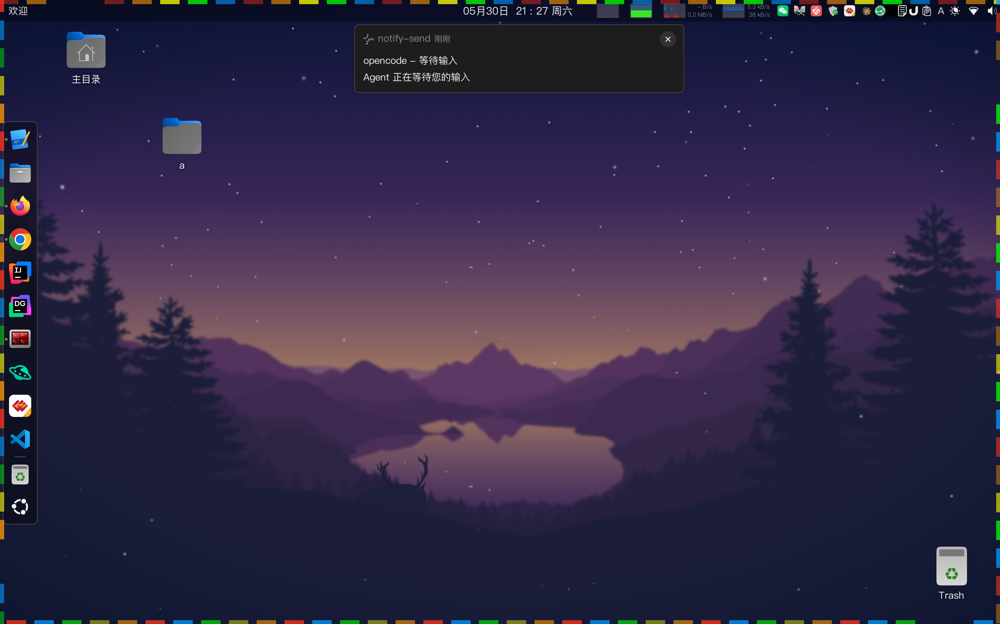

# opencode-notify

opencode 通知插件 — 监听会话关键事件，通过多渠道推送通知到手机、群聊或桌面。

> ⚠️ **个人项目，按需使用** — 主要在 Ubuntu 24.04 (X11) 环境测试，其他平台可能存在问题。
> 如有问题欢迎提 [Issue](https://github.com/luyanfeng/opencode-notify/issues)，不保证及时响应和修复。
>
> **版本发布说明**：本项目不再在 GitHub 发 Release 版本，请关注 npm 包 [@freely01/opencode-notify](https://www.npmjs.com/package/@freely01/opencode-notify) 的最新版本。

## 功能一览

- **多渠道通知**：系统通知 + 屏幕跑马灯 + **ntfy** + **Gotify** + 企业微信 + 飞书 + 自定义 Webhook
- **通知内操作按钮**（仅 ntfy）：权限请求的「允许 / 始终允许 / 拒绝」直接点按执行，不用回电脑敲命令
- **远程控制**（ntfy / Gotify）：用手机批准或拒绝权限、回答提问、追加指令、中断任务，详见[远程控制](#远程控制手机--插件--opencode)
- **会话感知抑制**：用户在 TUI 中操作时，屏上已可见的权限请求类通知自动过滤
- **屏幕遮挡检测**（Terminator）：子屏最大化被遮挡时强制通知，不遗漏
- **远程延迟推送**：任务完成后，对远程渠道额外延迟补偿推送，防止离开时错过
- **去重机制**：同一事件在时间窗口内不重复推送（跨进程用文件占位去重）
- **渠道级事件过滤**：每个渠道可独立配置监听哪些事件
- **诊断 CLI**：验证配置、发送测试通知、调试事件流

## 快速开始

### 1. 安装

```bash
npm install -g @freely01/opencode-notify
```

其他安装方式（本地 / Bun 等）见 [doc/install.md](doc/install.md)。

### 2. 注册插件

编辑 `~/.config/opencode/opencode.json`：

```json
{
  "plugin": ["@freely01/opencode-notify"]
}
```

### 3. 配置

首次启动自动生成默认配置 `~/.config/opencode/opencode-notify.yaml`，也可参考项目中的 `opencode-notify.yaml.example`。

```yaml
channels:
  system_message:
    mode: all
  wechat_work:
    mode: delay_only
    webhook_url: "https://qyapi.weixin.qq.com/cgi-bin/webhook/send?key=xxx"
  custom_webhook:
    mode: delay_only
    url: "https://gotify.example.com/message"
    headers:
      X-Gotify-Key: "your-app-token"

events:
  - permission_required
  - run_completed
  - run_failed
  - run_cancelled

remote_delay_channels:
  - wechat_work
  - custom_webhook
remote_delay_seconds: 180
```

### 4. 验证

```bash
tail -f ~/.opencode-notify/plugin.log
```

完整配置项参考下文的[配置参考](#配置参考)。

---

## 通知渠道

### 渠道模式

每个渠道通过 `mode` 控制通知时机：

| mode | 行为 |
|------|------|
| `all` | 即时通知 + 参与延迟推送 |
| `delay_only` | 仅通过延迟推送发送（不弹即时通知） |
| `none` | 禁用 |

### 系统消息通知

弹出 OS 原生通知横幅（macOS / Linux / Windows 均支持）。

```yaml
system_message:
  mode: all
```

### 屏幕跑马灯

通知时屏幕四边彩色高亮闪烁，视觉辅助。

```yaml
screen_flash:
  mode: all
  duration: 3.0        # 持续秒数
  speed: 4.0           # 移动速度因子
  intensity: 0.9       # 不透明度 0.0~1.0
```



### 自定义 Webhook

通用 HTTP 发送器，支持 Gotify / Bark / PushDeer / Slack / Discord 等。

```yaml
custom_webhook:
  mode: delay_only
  url: "https://gotify.example.com/message"
  method: "POST"
  headers:
    X-Gotify-Key: "your-app-token"
  template: '{"title":"{{title}}","message":"{{body}}","priority":5}'
```

| 参数 | 说明 |
|------|------|
| `url` | Webhook 地址 |
| `method` | `POST` / `GET`，默认 `POST` |
| `headers` | 自定义请求头 |
| `template` | 消息模板，支持 `{{title}}` `{{body}}` `{{event}}` `{{agent}}` `{{sessionID}}` |

### 企业微信

通过群机器人 Webhook 发送 Markdown 消息。

```yaml
wechat_work:
  mode: delay_only
  webhook_url: "https://qyapi.weixin.qq.com/cgi-bin/webhook/send?key=xxx"
```

### 飞书

通过自定义机器人或流程触发器 Webhook 发送消息。

```yaml
feishu:
  mode: delay_only
  webhook_url: "https://open.feishu.cn/open-apis/bot/v2/hook/xxx"
```

### ntfy（支持操作按钮）

支持 [ntfy.sh](https://ntfy.sh) 或自建服务端。**唯一支持通知内操作按钮的渠道** ——
权限请求的 `[允许] [始终允许] [拒绝]` 点按即执行，无需回电脑敲命令；按钮走 HTTP 回调
POST 回插件的命令话题，形成闭环。

```yaml
ntfy:
  mode: all
  server_url: "https://ntfy.example.com"
  token: "tk_xxxxxxxx"          # 受保护话题的 Bearer token（通知与回复共用）
  topic: "opencode"             # 单话题：通知 + 命令/回复
  # priority: 3
  # reply:                      # 回复能力（不配 = 纯单向通知）
  #   enabled: true
  #   # command_topic: "opencode-command"   # 省略 = 合并进 topic（推荐）
  #   transport: "stream"        # 命令读取：stream(长连接,默认) | poll(短轮询)
  #   bot_tag: "opencode"        # 插件消息标记（合并模式防回环）
  #   buttons: true              # 通知附带操作按钮（http）
  #   button_always: true        # 权限按钮含「始终允许」
  #   copy_button: true          # 提问/完成类附 [复制] 带令牌命令模板
```

| 参数 | 说明 |
|------|------|
| `server_url` | ntfy 服务端地址（`https://ntfy.sh` 或自建） |
| `token` | 受保护话题的 Bearer token，通知与回复共用 |
| `topic` | 通知话题；配了 `reply` 后建议保持单话题合并模式 |
| `reply` | 回复能力配置，见[远程控制](#远程控制手机--插件--opencode) |

**推荐合并单话题**：手机只订阅一个话题，通知与回复同源。插件发布的消息都带
`tags:[bot_tag]`，订阅端过滤自身消息防回环。

> ntfy 服务端每条通知**硬限 3 个 action**（超出需自编译服务端），所以提问类通知
> 在「选项 ≤2」时渲染 `[选项][选项][复制]`，「选项 ≥3 或 0」时只渲染 `[复制]`
> （此时正文列出全部选项编号，用 `select <令牌> N` 数字回复）。

### Gotify

自托管通知服务，支持通知与[远程控制](#远程控制手机--插件--opencode)。
**不支持通知内按钮**，回复仅文本命令（需手机端 HTTP Shortcuts / Tasker 等工具发命令）。

```yaml
gotify:
  mode: delay_only
  server_url: "https://gotify.example.com"
  app_token: "Axxxxxxxx"        # A 开头：发通知/回执
  # reply:
  #   enabled: true
  #   client_token: "Cxxxxxxxx"  # C 开头：读命令话题（必须用 client token）
  #   app_id: 3
```

> `app_token`（A 开头）用于发通知与回执；读取命令话题**必须**用 `client_token`（C 开头）。

---

## 远程延迟推送

这是本项目的核心特色。任务完成时先发即时通知（系统消息/跑马灯），3 分钟后如果你仍无操作，对远程渠道（企业微信 / 自定义 Webhook 等）额外补发一条延迟通知。

```yaml
remote_delay_channels:
  - wechat_work
  - custom_webhook
remote_delay_seconds: 180
remote_delay_max_count: 3
```

**取消策略**（延迟期内自动取消，不发送重复通知）：
- 你在 opencode TUI 中产生了操作 → 立即取消
- 你在电脑前读结果（有键盘/鼠标输入）→ 延迟触发时检测到空闲时间短 → 取消
- 你已离开电脑 → 空闲时间持续递增 → 正常发送

---

## 远程控制（手机 → 插件 → opencode）

让手机通过 **Gotify** 或 **ntfy** 远程批准/拒绝权限、回答提问、追加指令或中断任务。插件只做出站连接、**不监听任何端口**，适合公司电脑等无公网入口的场景。ntfy 默认使用**长连接订阅**（实时推送、请求极少），可用 `reply.transport: poll` 退回短轮询。

**用 ntfy 时推荐合并单话题**：手机只订阅一个话题，通知与回复同源。插件发布的通知都带 `tags:[bot_tag]`，订阅端过滤自身消息防回环。权限/提问通知底部渲染**操作按钮**（http 点按即执行；`[复制]` 把命令模板写剪贴板）。

命令（**必须携带通知里的一次性令牌**；无令牌的回复会被静默忽略）：

| 命令 | 作用 |
|------|------|
| `approve <令牌>` / `deny <令牌>` / `always <令牌>` | 允许一次 / 拒绝 / 始终允许（权限） |
| `select <令牌> <数字>` | 选该提问第 n 个选项 |
| `select <令牌> <任意文字>` | 提问的**自由回答**（不选选项，直接作答） |
| `say <令牌> <文本>` | 向会话追加指令（续接令牌 TTL 内可反复用） |
| `stop <令牌>` | 中断该会话 |
| `status <令牌>` / `help` | 查看待处理 / 帮助 |

> **只有 `select` 一个入口**回答提问：参数是**纯数字**才选第 n 项，**任意文字**按自由回答处理。
> （早期的 `answer` / `option` / `选择` / `选项` 同义词已移除，用了会被静默忽略。）
> 通知正文的选项编号也刻意**不带 `#`**，直接照抄 `select <令牌> 1` 即可。

> ✅ **opencode 2.x：提问可以从手机应答**
>
> 2.x 的提问（`question` 工具）会先建一张 **form**。该应答接口不在服务端插件 ctx 里，
> 因此本插件通过**同包的 `./tui` 入口**（终端进程内）代为投递，并经 **RPC 回调确认**闭环：
> 服务端派发请求 → TUI 调 `session.form.reply` → 回调确认成功与否。
>
> - 通知正文会显示**真问题**（`fields[i].title`）、补充说明（`description`）与
>   **每个选项及其说明**，不必回电脑看清要选什么。
> - 成功才消费令牌；失败与超时**保留令牌**（TTL 内可重试）并如实回执。
> - 多个终端同时在线时按「提问所在位置」收敛，仅归属客户端投递，其余静默。
> - **没有终端客户端运行时**，超时（默认 5 秒，`form_reply_timeout_ms` 可调）后回执
>   「当前没有终端客户端在运行，请回电脑处理」。
>
> **前提**：需要**有终端客户端在运行**（TUI/CLI）—— 应答由终端侧执行。
> 纯后台 `opencode run` 无终端时无法从手机应答（宿主会自行 dismiss 无头提问）。
>
> 若你把 opencode 配置里 `question` 权限设为 `ask`，提问会改走权限通道，那时可用 `approve` 应答。

**防重复**：通知里的令牌是**一次性**的（用后即废、默认 30 分钟过期），重复发送不受理；
多开 opencode / 多台电脑共用话题时，令牌含**server 进程**的实例前缀，**只有发通知的进程受理**——
无令牌或异主令牌一律静默忽略，不会串答或重复执行。

> 粒度说明：同一 server 进程内的多个项目目录（location）**共用同一前缀与同一份待处理注册表**，
> 因此**打开新项目、插件热重载都不会让已发出的令牌失效**；但多个 `opencode server` 进程之间仍严格隔离。

```yaml
channels:
  ntfy:
    mode: all                           # ntfy（支持按钮）| gotify
    server_url: "https://ntfy.example.com"
    token: "tk_xxxxxxxx"                # 通知与回复共用
    topic: "opencode"                   # 单话题：通知 + 命令/回复
    reply:                              # 回复能力（不配=纯单向通知）
      enabled: true
      # command_topic: "opencode-cmd"   # 省略=合并进 topic（推荐）；填写=分两个话题
      transport: "stream"               # stream（长连接，默认）| poll（短轮询）
      bot_tag: "opencode"               # 插件消息标记（合并模式防回环）
      copy_button: true                 # 提问/完成类附 [复制] 命令模板（仅合并模式）
      receipt_priority: 2               # 回执优先级（发往 topic，低于通知）
      secret: "my-shared-secret"        # 手动命令用；按钮回调免
```

Gotify 用法（无按钮，仅文本命令；读命令用 client token `C...`、发回执用 application token `A...`）与 ntfy 完整选项见 `opencode-notify.yaml.example`。

> ⚠️ **安全**：此通道可批准任意工具（含 shell）在电脑执行，等于远程操作电脑。务必设置 `secret` 或使用受保护话题，且不要把 token/secret 提交到仓库。

> **平台说明**：通知内按钮仅 **ntfy** 支持（Gotify 无此能力）。ntfy Android 体验完整；iOS 的通知按钮默认不在锁屏/通知中心显示（需点开 App），且 `clear` 行为有已知问题——但一次性令牌的防重复在服务端侧始终有效。

---

## 配置参考

### 配置文件位置

默认路径：`~/.config/opencode/opencode-notify.yaml`

### 配置项总览

```yaml
# 通知渠道
channels:
  system_message:
    mode: all
  screen_flash:
    mode: none
    duration: 3.5
    speed: 5.0
    intensity: 0.85
  custom_webhook:
    mode: none
    url: ""
    method: "POST"
    headers: {}
    template: ""
  wechat_work:
    mode: none
    webhook_url: ""
  feishu:
    mode: none
    webhook_url: ""

# 事件订阅
events: [permission_required, run_completed, run_failed, run_cancelled]
dedupe_seconds: 60

# 会话感知抑制
suppress_when_active: true
activity_timeout: 60
suppress_events_when_active:
  - permission_required
session_stale_timeout_ms: 600000

# 远程延迟推送
remote_delay_channels: []
remote_delay_seconds: 180
remote_delay_max_count: 3

# 日志
log:
  level: info
```

---

## 日志与故障排查

日志位于 `~/.opencode-notify/plugin.log`。

```bash
# 实时查看
tail -f ~/.opencode-notify/plugin.log

# 查看插件是否加载成功
grep "插件已加载" ~/.opencode-notify/plugin.log
```

**常见问题：**

**Q: 插件未加载？**  
确认 `opencode.json` 中 `plugin` 路径正确。

**Q: 通知没有弹出？**  
检查日志确认事件是否被监听到；检查渠道 `mode` 不是 `none`；检查 Webhook URL 有效性。

**Q: 远程延迟通知没有收到？**  
检查 `remote_delay_channels` 配置；检查延迟渠道的 `mode` 不是 `none`。延迟触发时日志会输出 `远程延迟: 已推送` 或 `远程延迟: 已取消`，可据此判断。

**Q: Webhook 通知失败？**  
确认 URL 有效且网络可达：

```bash
curl -X POST <webhook_url> -H "Content-Type: application/json" \
  -d '{"msgtype":"markdown","markdown":{"content":"**测试**"}}'
```

**Q: 重启 opencode 后，手机收到一堆"早就处理过的"旧通知？**

这是**宿主行为，不是插件 bug**。见下方「已知行为」。

---

## 已知行为

### 冷重启会重放「未结算」的权限/提问通知

**现象**

升级 opencode 或 server 进程重启后，手机会收到一批**明显陈旧**的权限请求 / 提问通知
（通常是几小时前、几天前，甚至更早就该被清理掉的那些）。

**原因**

opencode 里的权限请求和提问是**有状态聚合**，不是一次性事件。它们只有在被**结算**
之后才会消失，而结算只发生在：

- 你处理了它（`approve` / `deny` / `answer` / `select`）
- 或宿主主动结算（会话结束、会话被删、提问被 dismiss）

**从未被处理过的请求会一直保持"未结算"状态。** 而当插件在 server 重启后**重新订阅**
事件流时，宿主会把**当前所有仍未结算的请求**重新广播一次（用于恢复现场，避免正在等待
处理的请求凭空消失）。

所以这不是"事件没清理"，而是宿主主动做的**状态重放**。

**实测数据**（2026-09-30，一次升级 + 两次重启）：

| 时刻 | 事件 | 重放条数 |
|------|------|----------|
| 09:32 | 升级 2.0.19 → 2.0.20，冷重启 | 7 条 |
| 09:51 | server 再次冷重启 | 2 条 |

注意条数会**逐次递减**（宿主在逐步结算），但只要还有未结算的，**每次重启都会再来一遍**，
不是只发生一次。

**如何彻底消除**

把那些陈旧请求**处理掉或让会话结束**，宿主结算后就不会再重放了：

- 在 TUI 里直接 `approve` / `deny` / 回答掉
- 或者对该会话发 `stop <令牌>` 中断它
- 测试完记得**别让未处理的提问挂过夜**

**为什么插件不自动过滤**

插件拿不到请求的"创建时间"（`permission.asked` / `form.created` 事件载荷里没有时间戳），
无法区分"这是重放的旧请求"和"这是刚刚产生的新请求"。任何基于猜测的过滤都有**误杀
真实新请求**的风险，所以当前**保持原样不做过滤**。

日志判据（重放发生时会看到多条集中在几十秒内）：

```bash
# 统计同一 session 被反复通知的情况
grep "event=permission_required" ~/.opencode-notify/plugin.log | awk '{print $NF}' | sort | uniq -c | sort -rn
```
